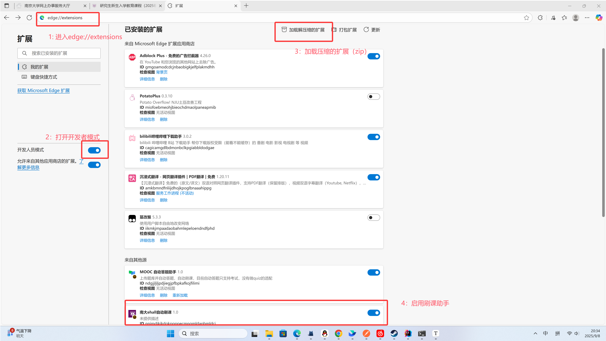
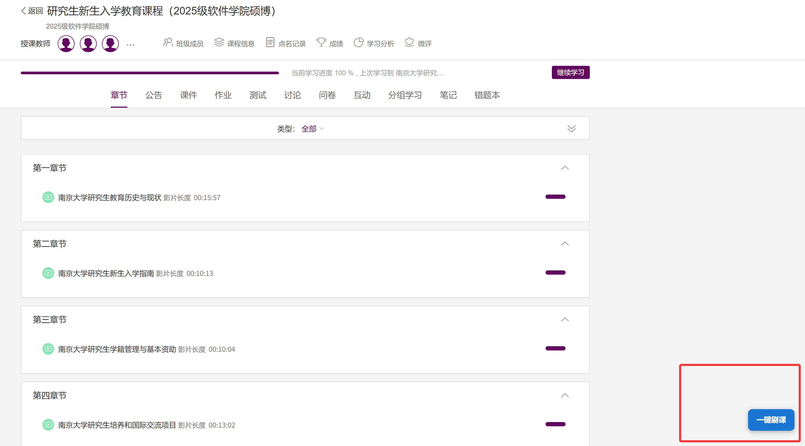
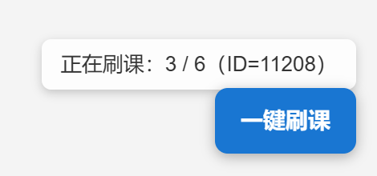

# 南大 eHall 刷课助手

本插件用于在南京大学 LMS 学习平台（[lms.nju.edu.cn](https://lms.nju.edu.cn)）页面中注入“一键刷课”功能，自动模拟课程学习进度的提交，适用于课程视频快速标记完成。

## 功能简介

由于某学校的ehall上课存在上课时间的检测，直接把进度条拉到底并不能够实现“需累积观看 80%(含)以上”这个指标。为了省出大家点击以及挂机的时间，我开发了这个插件，点击后即可通过接口自动化完成刷课过程并同步保证指标的完成。

## 使用步骤

### 1、安装插件

#### 【edge】

1. 进入edge://extensions
2. 打开开发者模式
3. 加载压缩的扩展，选择对应的zip包
4. 启用南大ehall自动刷课助手

#### 【chrome】

参考edge

### 2、登录学习平台

 打开并登录 LMS 学习平台（[lms.nju.edu.cn](https://lms.nju.edu.cn)），进入任意课程页面。

### 3、点击右下角按钮

 页面右下角会出现 `一键刷课` 按钮，点击后将提示是否继续操作。

### 4、确认责任声明

首次点击“一键刷课”按钮时，将弹出免责声明提示。用户必须明确同意该声明后才能继续使用插件功能。

请注意：**本插件仅为作者个人开发的学习用途脚本，属于开源分享性质的技术演示。**

作者不对本插件的任何使用效果、适用范围或使用后果承担责任。使用本插件即视为用户自愿承担一切风险与责任，包括但不限于：

- 使用过程中可能导致的账号异常或封禁
- 与教务系统记录冲突或学习行为异常
- 平台接口或政策更新带来的插件失效

简而言之，这只是一个开源技术玩具，请使用者自行判断其使用合法性与风险性，**作者不承担任何法律责任或平台责任**。

### 5、自动刷课执行

 插件将自动依次提交每门课程的视频学习记录。并实时显示刷课进度。

### 6、操作完成提示

 全部课程刷课完成后，页面将弹出提示，建议刷新页面以查看更新进度。

------

## 免责声明

1. 本插件仅供南京大学学生个人学习用途，使用者应遵守学校相关规定，严禁用于任何违反诚信、违纪违规的用途。
2. 插件以技术手段模拟客户端记录提交行为，不代表平台官方支持或认可。请在合理范围内使用，避免重复提交、异常请求等行为。
3. 插件作者不保存、不上传任何用户数据，也不对使用结果与使用后果负责。使用本插件所导致的任何账号异常、数据异常、处分责任等后果由使用者自行承担。
4. 使用本插件即表示您已阅读并同意本须知。如无法接受，请立即停止使用。
